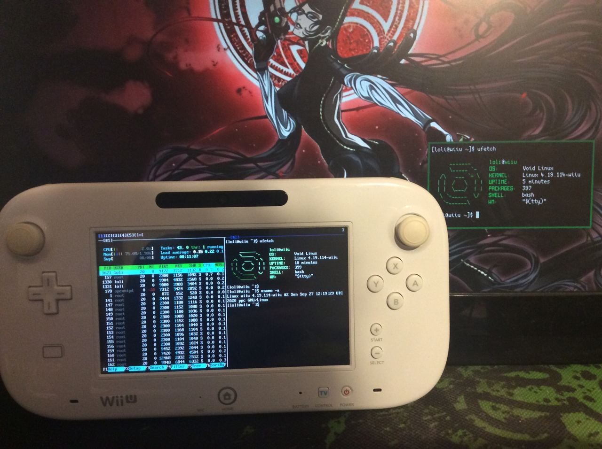

# Running Void Linux on the Wii U

had some fun modding my wii, here are my notes on how I set up void linux

we're going to be using the powerpc void linux fork: https://docs.voidlinux-ppc.org

note that the linux wiiu wifi adapter isn't supported, so you will need to either get a usb wifi
dongle or pre-download all the xbps packages you want to the sd card and roll with no internet

connect the wiiu sd to your pc, make a backup and repartition it so you have a linux partition
after the fat32 partition, then restore your fat32 files from backup. I used fdisk for this.

if you use rednand, take great care to recreate the sd partitions at the same starting offset as
before! the first 8 or 32 gigs are reserved for rednand

format the new linux partition

    sudo mkfs.ext4 /dev/disk/by-id/usb-Generic_USB_SD_Reader_00000000000006-0\:0-part2

for connectivity, I had to recompile my kernel with the rtl8192cu driver built-in and the various
firmware blobs embedded

here's how I compiled the kernel:

    git clone https://gitlab.com/linux-wiiu/linux-wiiu
    cd linux-wiiu
    git checkout rewrite-4.19
    docker run --rm -it -v $(pwd):/linux-wiiu -v /usr/lib/firmware:/lib/firmware \
      quarktheawesome/linux-wiiu-builder
    make wiiu_defconfig $LINUXMK
    make menuconfig $LINUXMK

in this menu, I searched for rtl8192cu by typing `/rtl8192cu` and pressing enter. this shows me
numbered result. I press 1 to jump to the first result which brings me to realtek devices. I enable
this by pressing space, navigate to `Realtek rtlwifi family of devices` , press enter on it and
press space on `Realtek RTL8192CU/RTL8188CU USB Wireless Network Adapter` .

we also need to embed the firmware because this kernel can't load modules, so I search for
`/extra_firm` and the first result brings me to `Build named firmware blobs into the kernel binary`
. I press enter on it to edit

now I need to figure out which blobs to add. in another window, I run

    ls /lib/firmware/rtlwifi/rtl8192cu*

which gives this list of blobs

    /usr/lib/firmware/rtlwifi/rtl8192cufw.bin    /usr/lib/firmware/rtlwifi/rtl8192cufw_B.bin
    /usr/lib/firmware/rtlwifi/rtl8192cufw_A.bin  /usr/lib/firmware/rtlwifi/rtl8192cufw_TMSC.bin

so I type this into the menu setting

    rtlwifi/rtl8192cufw.bin rtlwifi/rtl8192cufw_B.bin rtlwifi/rtl8192cufw_A.bin rtlwifi/rtl8192cufw_TMSC.bin

then I press tab to select OK and press enter. the firmware blobs root directory should already
be `/lib/firmware` . if not, change it

I also disable the hid wiiu drc driver because it makes the mouse unusable (corners are not
reachable with the analog stick and it fights my usb mouse). just search for `/wiiudrc` and disable
`Nintendo Wii U GamePad over internal DRH`

then I spam esc until it asks me to save and say yes.

now compile with this command (change -j8 to the number of threads/cores your cpu has)

    make -j8 $LINUXMK

if all goes well, the output should end with something like

      WRAP    arch/powerpc/boot/dtbImage.wiiu
    INFO: Uncompressed kernel (size 0x86f3cc) overlaps the address of the wrapper(0x500000)
    INFO: Fixing the link_address of wrapper to (0x900000)
    rm arch/powerpc/boot/wiiu.dtb

exit the docker container with

    exit

mount your fat32 sd partition and copy the kernel over

    sudo mount /dev/disk/by-id/usb-Generic_USB_SD_Reader_00000000000006-0\:0-part1
    sudo cp arch/powerpc/boot/dtbImage.wiiu /mnt/sd/linux/

create `/mnt/sd/linux/boot.cfg` and put the following in it. it will allow you to boot from sd

    [loader]
    default=sd

    [profile:sd]
    name=SD
    kernel=sdmc:/linux/dtbImage.wiiu
    cmdline=root=/dev/mmcblk0p2 rootwait

you also need the latest `fw.img` for the linux loader, download it from here:
https://gitlab.com/linux-wiiu/linux-loader/-/jobs/artifacts/master/raw/fw.img?job=master-build

and put it in `/mnt/sd/fw.img`

you can boot this from your favorite cfw loader. I use the homebrew channel through the browser
exploit at wiiuexploit.xyz and installed cfw loader from the homebrew store

unmount the fat32 partition

    sudo umount /mnt/sd

download the `void-ppc-ROOTFS` file from https://repo.voidlinux-ppc.org/live/current/

mount the sd card and install the rootfs

    sudo mkdir /mnt/sd
    sudo mount /dev/disk/by-id/usb-your-sd-card-part2 /mnt/sd
    cd /mnt/sd
    sudo tar -xvpf /path/to/void-ppc-ROOTFS-*.tar.xz

make sure the root fs is mounted with noatime in `/mnt/sd/etc/fstab` (more sdcard friendly)

    none /  auto    rw,noatime,data=ordered

now we need xbps (the void package manager) installed on our pc so we can pre fetch some packages.
arch has xbps in the aur, if your distro doesn't provide it you can always get a static binary

    wget https://repo.voidlinux-ppc.org/static/xbps-static-0.59_5.ppc-musl.tar.xz
    mkdir sxbps && cd sxbps
    tar xvf ../xbps-static*.tar.xz
    sudo cp usr/bin/xbps-install.static /usr/local/bin/xbps-install

pre-download wpa-supplicant and other basic stuff as we won't have internet otherwise

    sudo xbps-install -R https://repo.voidlinux-ppc.org/current/ppc \
      -r /mnt/sd/ -D xbps wpa_supplicant

boot into it, login with root/voidlinux and change the root password with `passwd`

create your user and add it to wheel

    useradd -m myuser
    usermod -a -G wheel myuser

allow wheel group to run sudo with no password (remove `NOPASSWD:` to be asked for the password)

    %wheel ALL=(ALL) NOPASSWD: ALL

install xbps and wpa_supplicant

    xbps-install -S xbps wpa_supplicant

now we can configure wpa_supplicant and get some internet

    wpa_passphrase ssid password >> /etc/wpa_supplicant/wpa_supplicant.conf
    ln -s /etc/sv/wpa_supplicant /var/service
    sv start wpa_supplicant
    echo 'nameserver 8.8.8.8' > /etc/resolv.conf

I'm gonna go with a static ip so I run this to get an ip for the time being

    ip link set dev wlan0 up
    ip addr add 192.168.1.11/24 brd + dev wlan0
    ip route add default via 192.168.1.1

and I add the same to `/etc/rc.local` so it runs at boot

if `wlan0` doesn't exist, check what it's named with `ip addr`

reconfig everything for good measure

    xbps-reconfigure -f -a

we need to set up the clock or xbps signature checks will fail

    date -s 'Mon Sep 28 03:22:38 PM CEST 2020' # get this string by running date on another pc
    ln -s /usr/share/zoneinfo/Europe/Rome /etc/localtime # use your timezone here

also set up a hostname

    echo "wiiu" > /etc/hostname

now we can update everything

    update-ca-certificates
    xbps-install -Su

enable ssh if you want to ssh into the wiiu from your pc

    ln -s /etc/sv/sshd /var/service
    sv start sshd

type `exit` and login as your user

at this point you can set up the system the way you prefer, one thing I would recommend is to add
these aliases at the top of your `~/.bashrc` to not have to type the full xbps commands every time

    alias xi='sudo xbps-install'
    alias xu='sudo xbps-install -Suv && sudo xlocate -S'
    alias xr='sudo xbps-remove -R'
    alias xq='xbps-query -Rs'
    alias xl='xbps-query -l'
    alias xf='xlocate'

note: you need to install xtools for these (which includes xlocate)

note: run `source ~/.bashrc` to refresh aliases without relogging

also, since audio isn't supported for now you want to config alsa to use the null output so
programs that need audio don't crash

    echo 'pcm.!default "null"' > ~/.asoundrc

for the desktop I have my own fork of dwm which I compile and install from source

    xi libX11-devel libxcb-devel libXft-devel gcc make dmenu xorg-minimal libXinerama-devel \
       pkg-config harfbuzz-devel xf86-video-fbdev mesa-dri xterm
    cd /path/to/dwm
    sudo make install

and this is my `~/.xinitrc` (install xset nitrogen and clipmenu)

    xset m 0 0                        # no mouse accel
    xset r rate 200 60                # keyboard repeat rate
    xset s off -dpms                  # no display blanking
    clipmenud &
    nitrogen --restore
    exec dwm

let's also show a tty on the gamepad's screen. install `fbset` and run this

  sudo con2fbmap 2 1

you can activate the tty by switching to it with CTRL + ALT + F2, and switch back to xorg with
CTRL + ALT + F1

xorg screen will be frozen and vice versa when you switch tty's as only one can be active at once

you can set this to run at boot by adding it to `rc.local`

    echo 'con2fbmap 2 1' | sudo tee -a /etc/rc.local

if you want xorg to use both screens instead, put this in your `/etc/X11/xorg.conf`

you still need the con2fbmap in `rc.local` to initialize the fbdev

    Section "Device"
            Identifier      "FBDEV 0"
            Driver          "fbdev"
            Option          "fbdev" "/dev/fb0"
    EndSection

    Section "Device"
            Identifier      "FBDEV 1"
            Driver          "fbdev"
            Option          "fbdev" "/dev/fb1"
    EndSection

    Section "Monitor"
            Identifier      "AOC1"
    EndSection

    Section "Monitor"
            Identifier      "AOC2"
    EndSection

    Section "Screen"
            Identifier      "screen0"
            Device          "FBDEV 0"
            Monitor         "AOC1"
    EndSection

    Section "Screen"
            Identifier      "screen1"
            Device          "FBDEV 1"
            Monitor         "AOC2"
    EndSection

    Section "ServerLayout"
            Identifier      "default"
            Screen 0 "screen0" 0 0
            Screen 1 "screen1" 213 720
            Option "Xinerama" "1"
    EndSection

I also exported (and installed) a few default applications in my `~/.bashrc`

    export EDITOR=neatvi
    export TERMINAL=xterm
    export BROWSER=qutebrowser

let's test that xorg works by running `startx`

if it worked, let's make xorg start automatically when we into tty1 by adding this at the bottom
of `~/.bashrc` which basically just checks tty number and startx's if the session is interactive

    [ "$(tty)" = "/dev/tty1" ] && ! pgrep -x Xorg >/dev/null && exec startx

I also noticed that the clock resets on reboot so installed openntpd, commented out the
constraints in `/etc/ntpd.conf` and enabled the service

    sudo ln -s /etc/sv/ntpd /var/service
